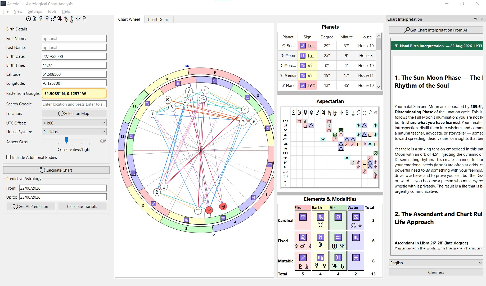

# Asteria L - Astrological Chart Calculator with AI Interpretations

Asteria L is a comprehensive astrological chart application that combines traditional astrology with modern AI technology. Calculate, visualize, and interpret natal charts, transits, progressions, returns, and relationship charts with precision and insight.

The easiest way to get started is to download the [latest release](https://github.com/lejean2000/Asteria/releases).

This is a fork of the [Asteria](https://github.com/alamahant/Asteria) project by Alamahant, adding:

- A **dual progressed/natal bi-wheel chart** with progressed-to-natal interaspects
- A **Draconic chart** bi-wheel with its own soul-layer-vs-outward-personality AI reading
- Full **Synastry** bi-wheel with interaspects and a dedicated relationship AI reading, alongside Composite and Davison charts
- A longer, in-depth **natal chart AI reading** and **improved transit interpretations** — transits are always calculated against your true natal chart, no matter what chart type is currently on screen
- Every AI reading is saved as a structured entry (chart, transit, or info) with timestamp, model name, and transit period, and is **backward compatible** with old save files
- **Collapsible headers** in the interpretation window so multiple readings stay organized, plus a **Copy HTML** option for pasting formatted readings straight into Word or other rich-text apps
- An indeterminate **"Waiting for AI reply..."** progress indicator while a chart or transit interpretation is in flight
- AI reasoning set to **high effort** with higher default API limits
- A managed **Windows installer** (Inno Setup) with the MSVC runtime and ephemeris data bundled
- Configurable Swiss Ephemeris paths at build time, editable lat/lon fields, planet icons in the modalities window

## Features

- **Natal Chart Calculation**: Generate accurate birth charts with precise planetary positions
- **Secondary Progression (Dual Bi-Wheel)**: Calculate a progressed chart for any age, overlaid with the natal chart, including a progressed-to-natal interaspect table and its own AI reading
- **Draconic Chart (Dual Bi-Wheel)**: Compare your natal chart against its draconic rotation, with draconic-to-natal interaspects and a dedicated soul-layer AI reading
- **Interactive Chart Display**: Visually explore your astrological chart with an intuitive interface
- **Aspect Analysis**: Examine the relationships between planets with detailed aspect tables
- **House and Sign Placements**: View planetary positions by house and zodiac sign
- **Element & Modality Balance**: Analyze the distribution of elements and modalities in your chart
- **AI-Powered Interpretations**: Receive personalized chart readings using advanced AI technology
  - Long-form natal readings based on a 130-line structured prompt
  - Enhanced transit interpretations with period-aware context, always grounded in your true natal chart
  - Interpretations stored as typed, timestamped entries with collapsible headers
  - **Copy HTML** from any interpretation card's context menu for formatted paste into Word and other rich-text editors
- **Modern UI**: Clean, user-friendly interface suitable for both beginners and experienced astrologers
- **Extended Time Range**: Calculate charts from 3000 BC to 3000 AD with high precision
- **Relationship Charts**: Compare natal charts with synastry, composite, and Davison analysis
- **Windows Installer**: One-click setup that bundles Qt libraries, MSVC runtime, and ephemeris data

## Installation

### Windows

Download the latest installer from the [Releases page](https://github.com/lejean2000/Asteria/releases) and run `AsteriaL_x.x_Setup.exe`. The installer bundles the application, Qt libraries, the Visual C++ runtime, and the Swiss Ephemeris data files.

### From Source

To build from source:
- Clone the repository
- Create build directory
- Configure and build with CMake
- Install

Build requirements: CMake + Ninja, MSVC 2022 BuildTools, Qt 6, and the Swiss Ephemeris source. The Swiss Ephemeris data path is configurable via CMake options.

## Usage

- Launch Asteria L from your applications menu
- Enter birth details (date, time, and location)
- Generate your natal chart
- Explore different aspects of your chart using the tabbed interface
- Request AI interpretations for deeper insights into your astrological profile
- Open multiple windows and drag-and-drop charts between them (Ctrl + Left-Click)

## Technical Details

Asteria L is built with:
- Qt 6 for the user interface
- C++17 for core functionality
- Swiss Ephemeris for astrological calculations
- OpenAI-compatible AI API (works with Mistral, OpenAI, Groq, Ollama, OpenRouter, and more) for chart interpretations

## Contributing

Contributions are welcome! Please feel free to submit a Pull Request.
- Fork the repository
- Create your feature branch
- Commit your changes
- Push to the branch
- Open a Pull Request

## License

This project is licensed under the GNU Affero General Public License v3.0 (AGPL-3.0) to comply with the licensing requirements of Swiss Ephemeris.

See the LICENSE file for details.

## Credits

### Swiss Ephemeris
- Copyright (C) 1997-2021 Astrodienst AG, Switzerland
- Licensed under the GNU Affero General Public License v3.0
- https://www.astro.com/swisseph/
- https://github.com/aloistr/swisseph

### OpenStreetMap
- © OpenStreetMap contributors
- Data is available under the Open Database License (ODbL)
- https://www.openstreetmap.org/copyright

### Astromoony Font
- Created by Robert Winslow
- Released to the public domain
- https://github.com/RobertWinslow/Astromoony-Font

### Qt Framework
- Used for the application's user interface and cross-platform compatibility
- https://www.qt.io/

### Original Project
- [Asteria](https://github.com/alamahant/Asteria) by Alamahant - the upstream project this fork is based on

## Contact

Project Link: [https://github.com/lejean2000/Asteria](https://github.com/lejean2000/Asteria)

> "The cosmos is within us. We are made of star-stuff." - Carl Sagan